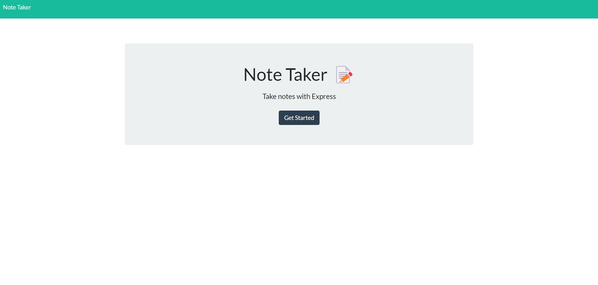
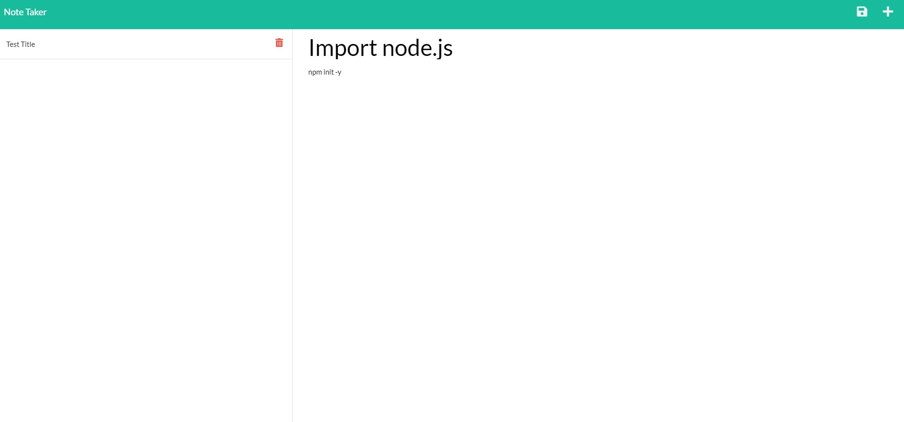

<div align="center">

# Scribbles (with mysql2)

</div>


<div align="center">

[](https://opensource.org/licenses/MIT) [](https://nodejs.org/en/)

</div>


This application is intended to server as an update to note taker using mysql2 CLI, developing a databasing system for the application. Watch this space for further development.

## Requirements

This application is run completely in the browser. you may visit [https://scribbles-the--note-taker.herokuapp.com/]. However, see below to load application on your local machine using node.


## Installation

To run this app on the local terminal, run;
```
git clone {http}
```

Open in preferred text editor and initialise node and add dependencies.
```
npm init -y
npm i (install existing dependancies)
```

run application
```
npm start (nodemon app.js)
```

Load application on localhost, follow provided link from console on start
```
http://localhost:{Set port}
```

## Credits

[Origin 42](https://github.com/origin-42): Dave Plummer

## Questions

Direct any questions too;

- [origin-42](https://github.com/origin-42)
- d.plummer89@hotmail.com

## Extras





